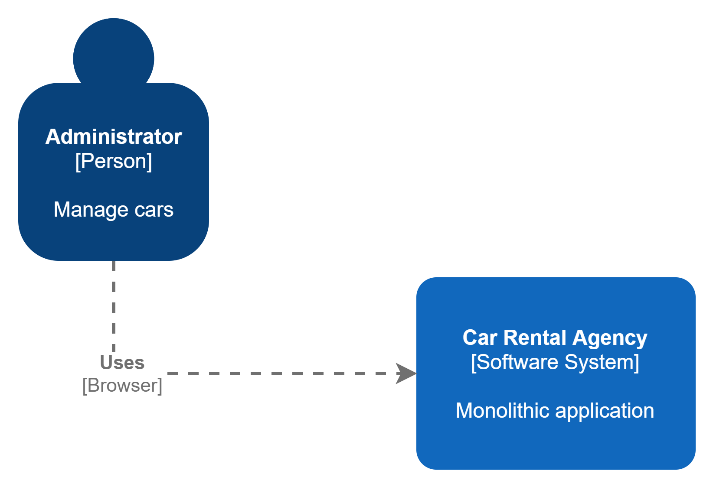
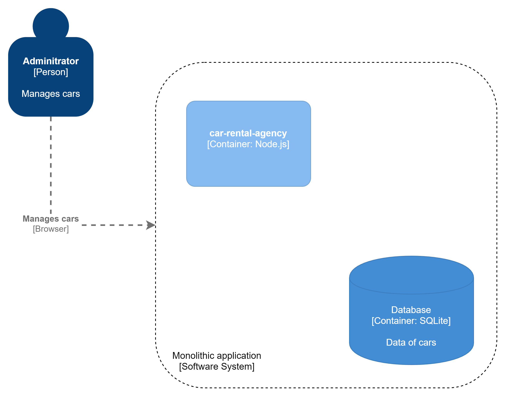

# car-rental-agency

## Description
A monolithic app about a car rental agency

## Installation

```bash
$ npm install
```

## Running the app

```bash
$ npm run start

# watch mode
$ npm run start:dev
```

## Test

```bash
# unit tests
$ npm run test

# watch mode
$ npm run test:dev

# test coverage
$ npm run test:cov
```

## Arquitecture

### c4 diagrams

#### Level 1


#### Level 2


#### Level 3


### Folder structure

| Route                            | Explanation                                                                                   |
| -------------------------------- | ----------------------------------------------------------------------------------------------|
| public                           | contain their own public and static files, this includes css, js and images                   |
| src                              | contain the app                                                                               |
| src/app.js                       | entry point of the app                                                                        |
| src/config                       | application configuration                                                                     | 
| src/module                       | contains all the application modules                                                          |
| src/module/car                   | everything related to the car module                                                          |
| src/module/car/car.entity.js     | Car base entity                                                                               |
| src/module/car/controller        | controller of the module, handles HTTP request                                                |
| src/module/car/mapper            | maps flat objects to the Car entity                                                            |
| src/module/car/repository        | Interacts with the database                                                                    |
| src/module/car/service           | Business logic                                                                                 |
| src/module/car/view              | UI corresponding to the module                                                                 |
| src/module/car/module.js         | entry point of the module                                                                      |